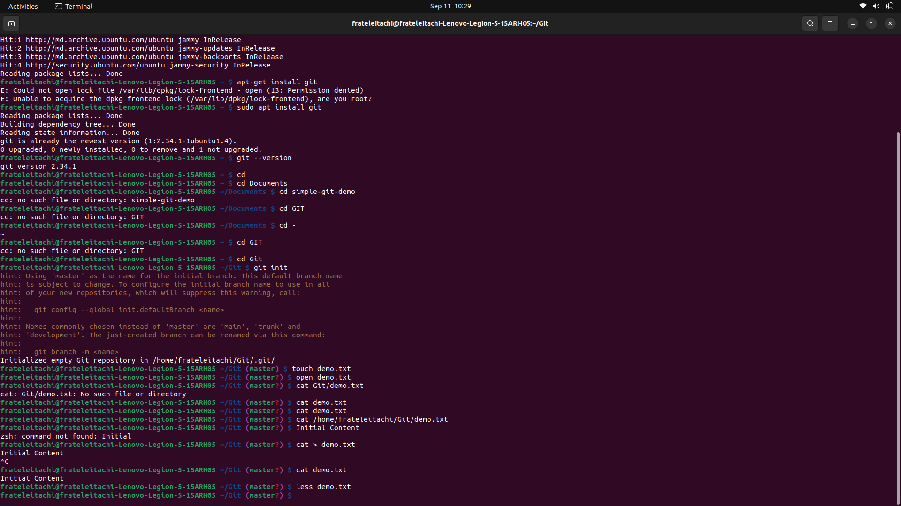

# oop-lab0
Screenshots that go along the proccess of setting up the os, setting up zsh, and oh-my-zsh, installing git, creating the repo, pushing the reop, making commits, compiling the program with gcc and make
Since is my first interaction with Linux, I want to make a disclaimer that some things can be quite messy. All my screenshots will be in order and named after the step that is showen in them.

Setting up Ubuntu I forgot about making screenshots. So I will describe it here. I used the disk manager to take 80gb out of my D disk. After that I created a live usb with Ubuntu, I made three partition of that 80gb and created home,root and swap. And the rest of instalation is pretty common knowledge.

Installing zsh

Installing oh-my-zsh with custom theme

Installing Git

Working with Git-Demo

Install GCC and Makefill

Setting up the repo with the Hello Word code

Compiled program using gcc

Compiled program using make
